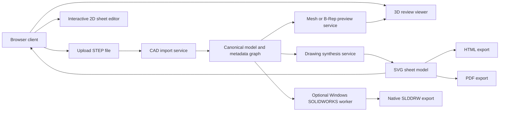

# Open-Source Plan for a Web Drawing Creation Tool

## Executive summary

The best **open-source-first MVP** is a **hybrid web application** built around **Open CASCADE Technology** for exact CAD import and geometry processing on the server, **SVG** for the sheet/drawing surface in the browser, and **three.js** or **OpenCascade.js** for interactive 3D review. For CAD ingestion, the fully open-source path should treat **STEP** as the primary supported input, preferably **AP242** where available, because OCCT explicitly supports STEP import, XDE metadata, assembly structures, and GD&T-related data, while STEPcode provides schema- and Part 21-level tooling. FreeCAD TechDraw is useful as a reference implementation and benchmark for page/view/section/hatch behavior, but it is better used as an oracle or prototype environment than as the embedded core of a controlled web product. citeturn10view2turn6view6turn10view3turn0search2turn10view5turn11view2

The one requirement that does **not** fit a pure open-source stack cleanly is **native `.slddrw` export**. In the primary sources reviewed here, the documented vendor-supported path for creating native SOLIDWORKS drawings is the **SOLIDWORKS API** on Windows, including drawing-view creation, BOM insertion, autoballoons, title blocks, and sheet formats; the **Document Manager API** is useful for file-level inspection and references, but it requires a subscription-linked license key. Because the official open-source components reviewed here document STEP exchange and web/browser workflows but do **not** document first-party native `.slddrw` authoring, the recommended plan is: **open-source-only MVP = STEP in, HTML/SVG/PDF out; fallback hybrid = add a small Windows SOLIDWORKS worker for `.slddrw` export only**. Exact SOLIDWORKS versions, hosting infrastructure, and PLM/ERP integration rules are unspecified and should be treated as inputs to the project charter. citeturn0search3turn4search1turn4search2turn4search0turn3search3turn3search0turn8search0turn0search2

## Minimal architecture

The recommended minimal architecture is a **hybrid** design with a thin browser client and a geometry-heavy backend. The browser owns interaction, overlays, drag-and-drop dimensioning, undo/redo, and export initiation. The backend owns STEP import, healing, assembly graph creation, hidden-line removal, sectioning, hatch generation, BOM derivation, and canonical drawing serialization. If native SOLIDWORKS export is mandatory, route only that job type to a Windows worker running desktop SOLIDWORKS through the official API. This split matches the strengths of the available tools: OCCT is strong in B-Rep, STEP/XDE, HLR, and sectioning; OpenCascade.js is useful in-browser but is still large enough that its own project recommends custom builds; and three.js is a mature browser renderer rather than a CAD kernel. citeturn10view2turn6view6turn6view7turn6view8turn10view5turn6view1



A practical responsibility split is straightforward. The **client** should be TypeScript-based and own the sheet canvas, view selection, dimension handles, snapping, collision visualization, keyboard shortcuts, and persistence of edit operations. The **server** should own exact geometry by way of OCCT or pythonOCC, because exact HLR is slower but much more appropriate for manufacturing drawings than mesh-only projection; OCCT explicitly documents exact HLR versus faster polygonal HLR, and that distinction should flow directly into your UX as “preview” versus “final.” Use the exact path for committed exports and the polygonal path for high-frequency interaction previews on very large inputs. citeturn6view7turn10view4

For the **open-source-only path**, keep the supported format matrix intentionally narrow: **STEP/AP203/AP214/AP242-in**, **HTML/SVG/PDF-out**. OCCT’s STEP guide states that the basic translator reads/writes geometry, topology, and assembly structures, while the XDE path can translate names, colors, layers, validation properties, materials, saved views, and GD&T-related data into an XDE document. That is enough to build a viable drawing tool if you treat native SOLIDWORKS input as unspecified and non-blocking in the MVP. citeturn10view2turn6view6

For the **fallback hybrid path**, add a small Windows queue with a single purpose: ingest either the original native SOLIDWORKS file or an intermediate model, then create a `.slddrw` from templates using the official SOLIDWORKS API. That worker can also use SOLIDWORKS sheet formats (`.slddrt`), title-block hotspots, BOM table templates, and autoballoons, all of which are documented in official help. Keep it isolated operationally because SOLIDWORKS and its APIs are Windows-centric and subscription/licensing-linked. citeturn3search2turn3search1turn4search0turn4search1turn4search2turn3search3turn3search0

## Prioritized implementation checklist

Before building code, lock a **drawing rules profile**. The MVP should explicitly state whether it follows an **ISO-first** profile or an **ASME-first** profile, because projection, line conventions, dimension presentation, and GD&T semantics differ in important details. The cleanest baseline is: **ISO 5456 for projection rules, ISO 129-1 for dimension/tolerance presentation, ISO 128 for line conventions**, with an optional **ASME Y14.5** profile later for teams that require US-style GD&T semantics. citeturn9search4turn9search5turn9search10turn8search3

| Priority | Milestone                           | Effort      | Acceptance criteria                                                                                                                                                                                           |
| -------- | ----------------------------------- | -----------:| ------------------------------------------------------------------------------------------------------------------------------------------------------------------------------------------------------------- |
| Must     | Canonical model and drawing schema  | High        | One JSON schema can represent parts, assemblies, views, projected edges, dimensions, notes, BOM rows, title-block fields, and export settings. A saved drawing can be reopened without loss of layout intent. |
| Must     | STEP import and metadata graph      | Medium      | Uploading AP203/AP214/AP242 STEP yields a canonical part/assembly tree, units, names, colors, layers, and available PMI/GD&T metadata where present. Failed imports return structured diagnostics.            |
| Must     | Projection and HLR engine           | High        | Front/top/right/isometric views are generated from the same model; final mode uses exact HLR; preview mode can use poly HLR for speed; visual golden files pass for at least 20 sample parts.                 |
| Must     | Interactive sheet editor            | High        | Users can drag dimensions, notes, balloons, and title-block fields; snaps are visible; collisions are detected; undo/redo works for every edit; keyboard-only equivalents exist for all pointer actions.      |
| Must     | SVG/HTML/PDF export                 | Medium      | Exported HTML renders a printable SVG sheet; Puppeteer or Cairo output matches the browser golden file within tolerance; PDFs preserve vectors for lines/text where practical.                                |
| Should   | Sections, centerlines, hatches, BOM | High        | One section-view workflow works end-to-end; hole centerlines and center marks render; assembly BOM is derived from the canonical assembly graph and can be reordered and ballooned.                           |
| Should   | Large-assembly performance          | Medium      | Preview mode remains responsive on agreed test models; server-side job queue isolates long HLR/section jobs; caching prevents recomputation of unchanged views.                                               |
| Could    | Open-source-only release            | Medium      | Public MVP supports STEP in, HTML/SVG/PDF out, and clearly documents that native `.slddrw` export is not part of the pure OSS distribution.                                                                   |
| Could    | Hybrid native SOLIDWORKS export     | Medium-high | A Windows worker can create a native `.slddrw` using templates, standard orthographic views, BOM insertion, and autoballoons through the official API.                                                        |

A practical **phase gate** for the agent is to separate the program into two tracks. The **OSS track** is successful once it creates a standards-profiled drawing from STEP with stable manual dimension dragging and good PDF/HTML output. The **hybrid track** is successful only when the Windows worker can deterministically produce `.slddrw` from a known template and a controlled set of sample models using the official API path. That second track should not be allowed to block the first. citeturn6view7turn6view8turn6view2turn6view3turn0search3turn4search1turn4search2

## Open-source component choices

The component shortlist below is intentionally biased toward **free, documented, cross-platform** building blocks, plus one clearly-labeled fallback dependency for native SOLIDWORKS export.

| Component                               | Recommended role                                             | Pros                                                                                                                    | Cons                                                                                              | License                           | Primary sources                                                                      |
| --------------------------------------- | ------------------------------------------------------------ | ----------------------------------------------------------------------------------------------------------------------- | ------------------------------------------------------------------------------------------------- | --------------------------------- | ------------------------------------------------------------------------------------ |
| **Open CASCADE Technology**             | Core geometry kernel and server-side CAD engine              | Exact B-Rep, STEP translator, XDE metadata, HLR, sectioning; cross-platform; mature docs                                | Heavier C++ stack; native SOLIDWORKS read/write is not documented in the reviewed OSS sources     | LGPL 2.1 + OCCT exception         | citeturn11view0turn10view2turn6view6turn6view7turn6view8                      |
| **pythonOCC**                           | Fast prototyping and Python-based services                   | Thin Python access to OCCT, cross-platform packaging, easy experimentation                                              | Not ideal as the final performance-critical core if you need tight memory and concurrency control | LGPL 3.0                          | citeturn10view4turn11view1                                                       |
| **STEPcode**                            | STEP schema/Part 21 tooling and validation utilities         | Cross-platform, BSD, expressive for schema-driven metadata pipelines                                                    | Not a geometric kernel; limited as a standalone drawing engine                                    | BSD-3                             | citeturn10view3                                                                   |
| **FreeCAD TechDraw**                    | Behavior oracle, prototyping benchmark, regression reference | Demonstrates technical drawing pages, dimensions, sections, hatching, SVG/PDF export                                    | Desktop app, not a clean embeddable web engine                                                    | LGPL 2+                           | citeturn0search2turn12search3                                                    |
| **OpenCascade.js**                      | In-browser exact geometry helpers for selective use          | WebAssembly bindings to OCCT; browser/cloud capable; custom builds supported                                            | Package size can be large; avoid making it the only engine for large assemblies                   | LGPL                              | citeturn10view5turn12search6                                                     |
| **three.js**                            | Browser 3D viewer layer                                      | Mature WebGL rendering, permissive MIT license, huge ecosystem                                                          | Mesh/viewer layer only; not a CAD kernel                                                          | MIT                               | citeturn6view1turn11view2                                                        |
| **Cairo**                               | Direct vector PDF backend                                    | Multi-page vector PDF surface; good if the server owns the final sheet scene graph                                      | More low-level than HTML-first PDF generation                                                     | LGPL 2.1 or MPL 1.1               | citeturn6view3turn12search1                                                      |
| **Puppeteer**                           | HTML/SVG-to-PDF export path                                  | Fast route from browser-authored sheet to print-quality PDF using `page.pdf()`                                          | Browser layout engine becomes part of your rendering contract                                     | Apache 2.0                        | citeturn6view2turn13search0                                                      |
| **SOLIDWORKS API and Document Manager** | Fallback-only native `.slddrw` export and file inspection    | Official, documented native drawing path; can create orthographic views, BOMs, autoballoons, title blocks/sheet formats | Proprietary, Windows-centric, Document Manager needs a license key; not an OSS path               | Proprietary / subscription-linked | citeturn0search3turn4search1turn4search2turn4search0turn3search3turn3search0 |

The recommended **default stack** for the agent is therefore: **TypeScript/React + SVG + three.js on the client; C++/OCCT on the server; pythonOCC only for prototypes, experiments, and test fixtures; STEPcode for low-level STEP validation if needed; Puppeteer first for PDF because it shortens the path from interactive drawing UI to printable output; Cairo later if you need a fully server-owned print backend**. Use FreeCAD TechDraw as a comparison target for section/hatch/page behaviors and as a source of golden test ideas, not as the runtime core. citeturn0search2turn10view4turn10view5turn11view2turn6view2turn6view3

## Interaction specification

The web UI should treat the drawing as a **constraint-aware 2D scene graph**, not a dead SVG. Every dimension should have three layers of state: **semantic anchors** on model-derived geometry, a **preferred placement** generated automatically, and a **user override** that survives regeneration unless the underlying anchors become invalid. This is the key product behavior that makes drag-and-drop dimensioning feel modern instead of brittle. The UI should never serialize only screen coordinates; it should serialize the anchor identities, the dimension type, placement offsets, leader routing hints, style profile, and a “locked by user” flag. That lets regeneration preserve intent when the sheet is reflowed or the view scale changes. The standards profile behind the UI should be explicit so that dimension-line conventions, leader treatment, and projection rules are not ad hoc. citeturn9search4turn9search5turn9search10turn8search3

The event model should be simple and deterministic. A typical drag cycle is: `pointerdown` on a selected dimension or note, compute eligible snap targets, show hover previews, `pointermove` with snapping and collision heatmap, `pointerup` to commit, then record one undoable command. Snapping should prioritize, in order: explicit geometry anchors, extension-line continuations, aligned dimension stacks, sheet frame guides, title-block cells, and BOM grid lines. Use a visible **snap distance** in sheet units, not pixels, so behavior remains stable across zoom levels. For dimensions specifically, distinguish between dragging the **text**, the **dimension line**, and one **witness-line endpoint**, because those are different intents.

Collision handling should be rule-based rather than fully automatic. On auto-placement, apply a deterministic pass: offset from geometry, avoid crossing the model silhouette, maintain a minimum text clearance, combine aligned dimensions into stacks when legal, and prefer moving text before moving witness lines. During user drag, do not “fight” the user; instead show warnings and permit local overlaps if the user insists, then surface a “repair layout” action later. That balance is important for expert users.

Undo/redo should use a **command log** rather than whole-document snapshots. Persist commands such as `MoveDimensionText`, `ReanchorDimension`, `ChangeViewScale`, `InsertSectionView`, `SetTitleBlockField`, and `ReorderBomRow`. This yields better auditability and makes collaborative or batched edits easier later. Keyboard shortcuts should cover the full pointer workflow: arrow keys for nudging, `Shift` for coarse nudge, `Alt` to temporarily suppress snapping, `R` to rotate a selected note/balloon if allowed, `L` to lock placement, and `Ctrl/Cmd+Z` / `Ctrl/Cmd+Shift+Z` for history.

Accessibility should be built in from the start rather than retrofitted. WCAG 2.2 requires keyboard-accessible interaction patterns and, at the guidance level, emphasizes that pointer-triggered actions should have keyboard equivalents. For this tool, that means every draggable drawing object needs a focus ring, keyboard pickup/drop semantics, an ARIA description of its anchors and current offset, and non-color-only collision warnings. The result will also help power users who prefer keyboard-driven drafting. citeturn9search3turn9search11

A minimal serialized dimension object can look like this:

```json
{
  "id": "dim-42",
  "viewId": "front",
  "type": "linear",
  "anchorA": { "edgeId": "e17", "param": 0.0 },
  "anchorB": { "edgeId": "e25", "param": 1.0 },
  "placement": {
    "mode": "user-override",
    "offsetSheet": [12.5, 8.0],
    "textOffset": [3.0, -2.0],
    "stackGroup": "stack-3"
  },
  "style": {
    "profile": "ISO",
    "precision": 2,
    "showTolerance": false
  },
  "locked": true
}
```

## Key flows and pseudocode

The backbone of the open-source MVP is **STEP → canonical model → projected 2D graph → SVG/HTML/PDF**. OCCT’s STEP translator and XDE tooling are the right building blocks for that server path, and OCCT’s HLR and section algorithms are the right primitives for view generation. citeturn10view2turn6view6turn6view7turn6view8

```python
# Python prototype with pythonOCC / OCCT-style APIs: STEP import into XDE
from OCC.Core.STEPCAFControl import STEPCAFControl_Reader
from OCC.Core.TDocStd import TDocStd_Document
from OCC.Core.XCAFApp import XCAFApp_Application

app = XCAFApp_Application.GetApplication()
doc = TDocStd_Document("XmlXCAF")

reader = STEPCAFControl_Reader()
reader.SetNameMode(True)
reader.SetColorMode(True)
reader.SetLayerMode(True)
reader.SetPropsMode(True)

status = reader.ReadFile("input.step")
if status != 1:
    raise RuntimeError("STEP read failed")

ok = reader.Transfer(doc)
if not ok:
    raise RuntimeError("STEP transfer failed")

# Walk XDE tools:
# - shape tool for assemblies/components
# - color tool for styled parts
# - dimtol tool for GD&T/PMI if present
# Build canonical_document from XDE labels and shapes.
```

```cpp
// C++ / OCCT: orthographic view + exact HLR for final output
HLRBRep_Algo hlr;
hlr.Add(shape);

Handle(HLRAlgo_Projector) proj =
    new HLRAlgo_Projector(gp_Ax2(viewOrigin, viewDir, upDir), false, 0.0);

hlr.Projector(proj);
hlr.Update();   // outlines
hlr.Hide();     // visible/hidden split

HLRBRep_HLRToShape out(hlr);
TopoDS_Shape visible  = out.VCompound();
TopoDS_Shape hidden   = out.HCompound();
TopoDS_Shape smooth   = out.Rg1LineVCompound();

// Convert resulting edges to a 2D vector graph in sheet coordinates.
```

```cpp
// C++ / OCCT: section edges from a cutting plane
gp_Pln cutPlane(gp_Pnt(0, 0, zCut), gp_Dir(0, 0, 1));
TopoDS_Face planeFace =
    BRepBuilderAPI_MakeFace(cutPlane, -1e6, 1e6, -1e6, 1e6);

BRepAlgoAPI_Section sec(shape, planeFace, Standard_False);
sec.Build();

TopoDS_Shape sectionEdges = sec.Shape();
// Next steps:
// 1) classify closed loops
// 2) hatch cut faces
// 3) style cut outlines and beyond-cut visible lines
```

Once the projected edge graph exists, convert it into a **sheet scene graph** with semantic layers rather than rendering it directly. A good minimum layer model is: `frame`, `titleBlock`, `viewGeometryVisible`, `viewGeometryHidden`, `sectionHatch`, `centerlines`, `dimensions`, `notes`, `bom`, and `selectionOverlay`. That scene graph can then be emitted as SVG for HTML and as either browser-printed PDF or Cairo PDF. FreeCAD TechDraw is useful here as a sanity check because its official docs explicitly describe pages containing views, dimensions, sections, hatched areas, annotations, symbols, and export to SVG/PDF. citeturn0search2

```javascript
// Browser-side: projected graph -> SVG
function edgeToSvgPath(edge2d) {
  if (edge2d.kind === 'line') {
    return `M ${edge2d.x1} ${edge2d.y1} L ${edge2d.x2} ${edge2d.y2}`;
  }
  if (edge2d.kind === 'arc') {
    return arcToSvg(edge2d);
  }
  if (edge2d.kind === 'bspline') {
    return splineToSvg(edge2d);
  }
  throw new Error('Unsupported edge kind');
}

function buildSvg(scene) {
  return `
  <svg xmlns="http://www.w3.org/2000/svg" viewBox="0 0 ${scene.w} ${scene.h}">
    ${scene.layers.viewGeometryVisible.map(e => `<path d="${edgeToSvgPath(e)}" class="vis"/>`).join('')}
    ${scene.layers.viewGeometryHidden.map(e => `<path d="${edgeToSvgPath(e)}" class="hid"/>`).join('')}
    ${scene.layers.dimensions.map(renderDimension).join('')}
    ${scene.layers.notes.map(renderNote).join('')}
    ${renderBom(scene.layers.bom)}
    ${renderTitleBlock(scene.layers.titleBlock)}
  </svg>`;
}
```

```javascript
// Interactive dimension placement and serialization
function onDimensionDragStart(dimId, pointer) {
  const dim = store.getDimension(dimId);
  interaction.begin({
    type: 'move-dimension',
    dimId,
    original: structuredClone(dim),
    snapCandidates: computeSnapCandidates(dim.viewId),
  });
}

function onDimensionDragMove(pointer) {
  const ctx = interaction.current();
  const snap = findBestSnap(pointer.sheetPt, ctx.snapCandidates, {
    radiusSheet: 2.5,
    priority: ['geometry', 'stack', 'guide', 'frame']
  });

  const proposal = proposePlacement(ctx.dimId, pointer.sheetPt, snap);
  const repaired = resolveCollisions(proposal, store.sceneGraph, {
    moveTextFirst: true,
    preserveUserLock: false
  });

  store.previewDimension(ctx.dimId, repaired);
}

function onDimensionDragEnd() {
  const ctx = interaction.current();
  const next = store.commitPreview(ctx.dimId);

  history.push({
    kind: 'MoveDimensionText',
    dimId: ctx.dimId,
    before: ctx.original.placement,
    after: next.placement
  });

  persistPatch({
    op: 'replace',
    path: `/dimensions/${ctx.dimId}/placement`,
    value: next.placement
  });
}
```

For web export, prefer **SVG-in-HTML** because it keeps the sheet legible, inspectable, and printable. For PDF, start with **Puppeteer** because the official `page.pdf()` pipeline is simple and already aligned with print CSS; move to **Cairo** only if you later need a fully server-owned vector print backend or you need to bypass browser layout differences. citeturn6view2turn6view3

```javascript
// HTML + PDF export via Puppeteer
import puppeteer from 'puppeteer';
import fs from 'node:fs/promises';

const html = `
<!doctype html>
<html>
<head>
  <style>
    @page { size: A3 landscape; margin: 8mm; }
    body { margin: 0; }
    svg { width: 100%; height: auto; }
  </style>
</head>
<body>${svgMarkup}</body>
</html>`;

await fs.writeFile('drawing.html', html, 'utf8');

const browser = await puppeteer.launch({ headless: true });
const page = await browser.newPage();
await page.setContent(html, { waitUntil: 'networkidle0' });
await page.pdf({
  path: 'drawing.pdf',
  printBackground: true,
  preferCSSPageSize: true
});
await browser.close();
```

If the fallback native export path is enabled, keep it small and template-driven. Official SOLIDWORKS help documents the creation of standard orthographic views, BOM table insertion, autoballoons, title-block editing, and sheet format handling; use those capabilities rather than trying to synthesize every native drawing object manually. citeturn0search3turn4search1turn4search2turn4search0turn3search3

```csharp
// Windows worker sketch: create SLDDRW through SOLIDWORKS API
using SldWorks;

var swApp = new SldWorks.SldWorks();
swApp.Visible = false;

string drawingTemplate = @"C:\templates\A3_ISO.drwdot";
string modelPath = @"C:\job\source.sldprt";
string outputPath = @"C:\job\result.slddrw";

ModelDoc2 drawing = swApp.NewDocument(drawingTemplate, 0, 0, 0);
DrawingDoc dd = (DrawingDoc)drawing;

// Standard 3-view creation
bool ok = dd.Create3rdAngleViews2(modelPath);

// Add BOM if assembly / configured template path known
drawing.Extension.InsertBomTable4(
    true, 0.0, 0.0,
    /* anchor */ 1,
    /* bomType */ 2,
    /* config */ "",
    @"C:\templates\bom-standard.sldbomtbt",
    false,
    /* numbering */ 0,
    false
);

// Optional autoballoons
var opts = dd.CreateAutoBalloonOptions();
dd.AutoBalloon5(opts);

// Save native result
drawing.SaveAs3(outputPath, 0, 0);
swApp.CloseDoc(drawing.GetTitle());
```

## Testing and risk management

Your test strategy should be built around **golden files** from the first week. The most important regressions in a drawing tool are visual and standards-related, not numerical alone. Maintain a corpus of representative STEP files that covers: simple prismatic parts, filleted parts, hole patterns, thin-walled sections, assemblies with repeated components, AP242 files with metadata/PMI, and deliberately broken files. For each fixture, keep a golden SVG and PDF for front/top/right/isometric, one section, one BOM sheet, and one manually-edited dimension layout. Re-render on every change and compare with vector-aware or rasterized visual diffs. OCCT’s own exact-versus-poly HLR distinction makes it natural to maintain separate preview and final-output tolerances. citeturn6view7turn6view8turn6view2turn6view3

Acceptance tests should check more than images. Add rule tests for dimension semantics: the serialized anchors remain stable after a view-scale change; a user-locked dimension does not jump during regeneration; collision repair never silently changes a locked dimension; and keyboard interactions are parity-tested against pointer workflows. Add standards-profile tests: ISO projection marker and view layout, line-type conventions per your chosen profile, dimension formatting per ISO 129-1 or the chosen ASME profile, and accessibility tests informed by WCAG keyboard requirements. citeturn9search4turn9search5turn9search10turn8search3turn9search3turn9search11

The main technical risks are concentrated in four places. **First**, native SOLIDWORKS interoperability remains the largest gap in a pure OSS stack; mitigate it by making STEP/AP242 the supported MVP input and treating native `.slddrw` as a separate fallback capability. **Second**, exact HLR and sectioning can become expensive on large assemblies; mitigate that with preview/final modes, derivative caches, and job queues. **Third**, automatic dimension placement can easily produce clutter or invalid drafting; mitigate by making auto-placement conservative and letting users drag/re-anchor dimensions freely. **Fourth**, licensing needs active review, because combining LGPL-family libraries, permissive libraries, and an optional proprietary worker backend changes redistribution obligations. OCCT’s exception helps, but you should still run a formal OSS review before distribution. citeturn11view0turn10view5turn11view2turn12search1turn3search0turn3search2

The recommended mitigation posture is therefore simple. Build the **pure open-source deliverable** so it is independently valuable: **STEP in, interactive sheet editing, HTML/SVG/PDF out, strong manual dimensioning UX, deterministic test corpus**. Then layer in the **Windows SOLIDWORKS worker** only if the business case for native `.slddrw` is strong enough to justify the operational and licensing burden. That sequencing gives the implementation agent a tractable MVP, preserves an open-source core, and avoids making the hardest interoperability problem the critical path. citeturn10view2turn0search2turn6view2turn3search2turn3search0