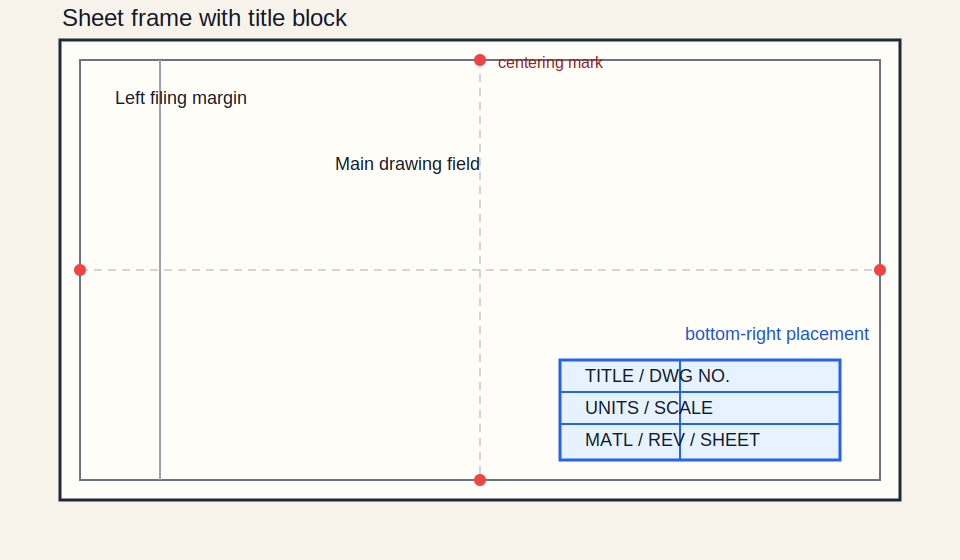

# 00 — Sheet & Title Block



## Core rule

The title block is the drawing's control panel: if units, projection, revision, material, and default tolerances are unclear, the rest of the sheet becomes easy to misread.

## Minimum content

| Field | Typical example | Why it matters |
|---|---|---|
| Drawing title | `Housing, Motor, LH` | Fast identification |
| Drawing number | `DWG-001234` | Document traceability |
| Part number | `PN-001234-01` | BOM and procurement |
| Revision | `B` or `02` | Prevents building the wrong version |
| Status | `Released` | Blocks accidental use of drafts |
| Units | `mm` | Prevents metric / imperial mixups |
| Scale | `1:1`, `1:2`, `2:1` | Correct print interpretation |
| Projection | `First-angle` + symbol | Prevents mirrored views |
| Material | `C45E EN 10083-2` | Process and cost |
| General tolerances | `ISO 2768-mK` | Default acceptance limits |
| Surface / finish note | `Ra 3.2 µm U.O.S.` | Default finish assumption |
| Sheet count | `Sheet 1 / 3` | Package completeness |
| Dates / signatures | drawn, checked, approved | Accountability |

## Placement and sheet basics

- Place the title block in the bottom-right corner.
- Keep text readable from the same direction as the main drawing.
- Use ISO sheet framing with the filing margin on the left.
- Keep centring marks and the projection symbol visible.

## Good habits

- Separate drawing number from part number if your system uses both.
- Declare units once in the title block if the whole sheet uses one unit system.
- Keep revision history synchronized with the title block revision.
- Put the general tolerance class in the title block or general notes, not only in tribal knowledge.
- For additive or coated parts, state both base material and process when function depends on the route.

## Quick example

```text
TITLE: BRACKET, SENSOR
DWG NO.: DWG-10428
PART NO.: BR-10428-01
REV: C
UNITS: mm
SCALE: 1:2
PROJECTION: FIRST-ANGLE
MATERIAL: EN AW-6082 T6
GEN. TOL.: ISO 2768-mK
FINISH: ANODIZE TYPE II BLACK
SHEET: 1 / 2
```

## Common mistakes

- Missing units while dimensions are written without suffixes.
- Revision table says one thing, title block says another.
- Projection text is present but the symbol is missing.
- Surface finish, material, or general tolerance defaults are hidden in scattered notes.
