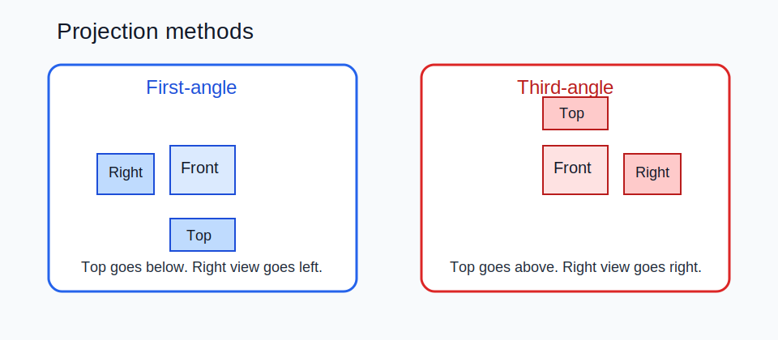

# 02 — Views & Projection



## Orthographic basics

Orthographic projection turns a 3D part into 2D views that can be dimensioned and manufactured. The key risk is not missing a view, but using the wrong projection method and reading the whole sheet backwards.

## First-angle vs third-angle

| Method | Market habit | Mental model | View placement cue |
|---|---|---|---|
| First-angle | Common in Europe | Plane is behind the part | Top view below front; right view left of front |
| Third-angle | Common in US | Plane is in front of the part | Top view above front; right view right of front |

## Practical rules

- Default to first-angle for ISO / DIN drawings unless the sheet explicitly states otherwise.
- Always show the projection symbol in the title block.
- Choose the front view that best exposes function and minimizes hidden lines.
- Use only as many orthographic views as needed to define the part clearly.
- Add an isometric view for recognition only; do not rely on it for dimension definition.
- Use removed, rotated, partial, or local views when they reduce clutter.

## Project note for `auto-drawing`

- Keep orthographic views line-based with hidden lines visible.
- Keep the small isometric recognition view as the only shaded / colored view.
- Do not show hidden-line presentation on the isometric recognition view unless a special case requires it.
- Verify the actual view display modes by exported preview image, not by enum-name assumptions alone.

## Fast recognition

```text
FIRST-ANGLE:
  right-side view sits on the left
  top view sits below

THIRD-ANGLE:
  right-side view sits on the right
  top view sits above
```

## Example layout

| View | First-angle position | Third-angle position |
|---|---|---|
| Top | below front | above front |
| Right | left of front | right of front |
| Left | right of front | left of front |

## Good drafting habits

- Keep the functional axis horizontal for turned parts unless there is a strong reason not to.
- If a view is removed or rotated, label it with an uppercase letter.
- If one local area carries the important geometry, use a detail or section instead of adding a full redundant view.
