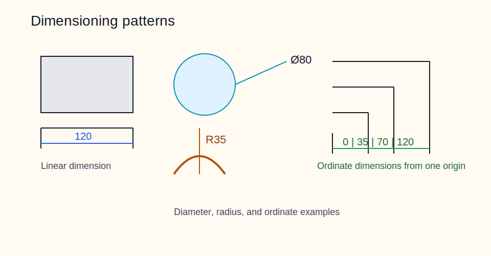

# 04 - Dimensioning



## Core rules

- State each essential size once, on the clearest view.
- Each controlling requirement must appear once only on the sheet.
- Do not dimension to hidden lines unless no clearer option exists.
- Keep extension lines off the part with a small gap and let them pass the dimension line slightly.
- Make vertical and horizontal ordinate dimensions the default, top-priority method wherever the geometry allows.
- Prefer datum-based or ordinate dimensioning for critical patterns; long chains accumulate error.
- Space dimension lines, leaders, and value text so they do not overlap each other.
- Do not use bracketed or parenthesized dimension values.
- Duplicate controlling dimensions are forbidden because they overdefine the drawing.

## Common dimensioning methods

| Method | Use | Risk / benefit |
|---|---|---|
| Chain | Simple serial features | Fast to read, but stacks tolerances |
| Baseline / parallel | Features from one baseline | Better functional control |
| Ordinate / ascending | Hole patterns, repeated features | Reduces stack-up |
| Angular | Inclined features | Must show angle clearly at the vertex |

## Reading styles you will encounter

- European style: text reads from the bottom and right side.
- US style: text tends to stay aligned with the title block.
- Mixed legacy sheets exist; normalize the meaning, not the text orientation.

## Fast symbol reference

| Symbol | Meaning | Example |
|---|---|---|
| `Ø` | diameter | `Ø20` |
| `R` | radius | `R6` |
| `SR` | spherical radius | `SR30` |
| `SØ` | spherical diameter | `SØ30` |
| `□` | square section | `□12` |
| `SW` | across flats | `SW17` |
| `C` | 45° chamfer shorthand | `C2` |
| `M` | metric thread | `M8×1.25` |
| `t` | thickness | `t2.5` |

## Common dimension types

### Diameter and spherical diameter

- Use `Ø` for circles, holes, and cylinders.
- Use `SØ` only for spherical surfaces.

### Chamfers

- `C2` means a 2 mm chamfer at 45°.
- For non-45° chamfers, write size × angle, for example `1.0 × 30°`.

### Radii

| Callout | Meaning |
|---|---|
| `R3` | simple 3 mm radius |
| `R6 ±0.1` | bilateral tolerance on radius |
| `RMIN2` | radius must be at least 2 mm |
| `RMAX6` | radius must not exceed 6 mm |
| `CR5 ±0.05` | controlled radius, smooth and tangent |
| `4× R1.5` | four identical radii |

### Ordinate and chain dimensions

- Use chain dimensions when convenience matters more than stack-up.
- Use ordinate dimensions when part function depends on common datums.

## Worked examples

```text
Ø18 H7
R6 ±0.1
2× C1.5
30° ±0.5°
4× Ø6 THRU
SØ30
```

## Good habits

- Put repeated counts in the callout: `4×`, `6×`, `TYP`.
- Use multiplicity callouts for repeated identical features instead of repeating the same controlling dimension.
- Keep radius and chamfer conventions consistent across the sheet.
- If the same feature is defined by size and position, use GD&T rather than repeating linear dimensions.
- Bias auto-generated drawings toward vertical and horizontal ordinate schemes before considering chain dimensions.
- If auto-placement creates collisions, move or prune dimensions until the sheet reads cleanly at a glance.
- If a value appears in brackets or parentheses, convert it to a normal controlling dimension style or remove it.

## Current repo limitation

- Generated previews still need visual review for crowding, overlap, and family-specific completeness such as sections or details.
