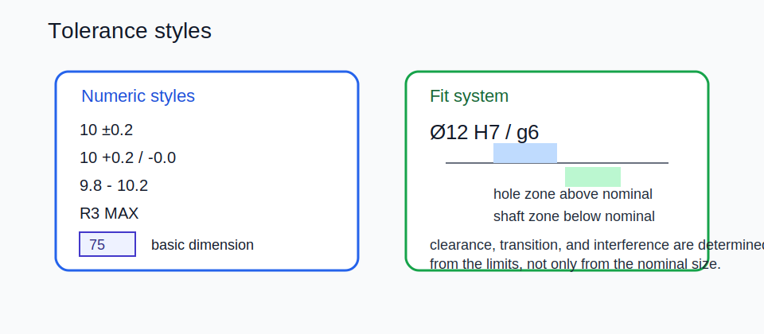

# 05 — General Tolerances, Fits, and Deviation Styles



## Quick rules

- Put one general tolerance class on the sheet, typically in the title block.
- Tighten only the features that functionally need it.
- Prefer basic dimensions plus GD&T over long tolerance chains.
- Use uppercase letters for holes and lowercase letters for shafts.

## IT grades and fits

| Concept | Meaning |
|---|---|
| `IT6`, `IT7`, `IT10` | Standard tolerance widths; lower number means tighter tolerance |
| `H7` | Common hole zone, lower deviation at nominal |
| `h7` | Common shaft zone, upper deviation at nominal |
| `H7/g6` | Typical sliding clearance fit |
| `H7/k6` | Typical transition fit |
| `H7/p6` | Typical interference fit |

## Fit types

| Fit | Result | Typical use |
|---|---|---|
| Clearance | Hole always larger | Sliding, easy assembly |
| Transition | Either small clearance or light interference | Location and alignment |
| Interference | Shaft always larger | Press fit |

## General tolerances

- `ISO 2768-f`, `m`, `c`, `v` cover untoleranced linear and angular dimensions.
- `ISO 2768-H`, `K`, `L` cover general geometrical tolerances.
- Combined note example: `ISO 2768-mK`.

## Deviation styles

| Style | Example | Meaning |
|---|---|---|
| Bilateral | `10.5 ±0.2` | symmetric plus and minus |
| Unequal bilateral | `10.5 +0.2 / -0.1` | asymmetric band |
| Unilateral | `10.5 +0.2 / -0.0` | one-sided allowance |
| Limit | `10.3 - 10.7` | upper and lower limits only |
| Single-limit | `R6 MIN`, `R6 MAX` | one hard bound |
| Reference | `(10.5)` or `10.5 REF` | informational only |
| Basic / exact | boxed dimension | variation controlled by GD&T |
| Approximate | `~10.5`, `ca. 10.5` | not inspection-driving |

## Practical guidance

- Relax to the loosest IT grade that still meets function.
- Put the target fit in words when it matters: `sliding fit`, `press fit`, `locating fit`.
- Use reference dimensions for convenience, not acceptance.
- Use boxed basic dimensions when the real control comes from a feature control frame.

## Worked examples

```text
ISO 2768-mK
Ø12 H7/g6
25 ±0.1
10.0 +0.2 / -0.0
R3 MAX
(42)
[boxed] 75
```

## Inspection mindset

- Clearance and interference are computed from the limits of the mating pair, not from the nominal size.
- If the sheet uses fits but never declares a general tolerance class, expect downstream questions.
