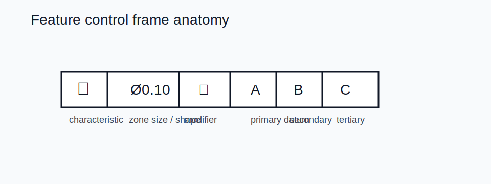

# 06 — GD&T



## What to read first

1. Characteristic symbol
2. Tolerance value and zone shape (`Ø` when cylindrical)
3. Material modifier if present (`Ⓜ`, `Ⓛ`)
4. Datum order: primary, secondary, tertiary

## Example frame

```text
POSITION | Ø0.10 | Ⓜ | A | B(Ⓜ) | C
```

Meaning: cylindrical positional zone of 0.10 at MMC, located from datums A, B, and C.

## Datums

- A datum feature is the real surface or hole on the part.
- The datum is the ideal plane, axis, or point derived from it.
- Primary, secondary, tertiary datums lock the part in order.
- Datum targets are used when the whole feature is not the intended contact area.

## Core characteristic groups

| Group | Typical controls |
|---|---|
| Form | straightness, flatness, circularity, cylindricity |
| Orientation | parallelism, perpendicularity, angularity |
| Location | position, symmetry, concentricity |
| Run-out | circular run-out, total run-out |
| Profile | line profile, surface profile |

## Modifiers that change manufacturing behavior

| Modifier | Effect |
|---|---|
| `Ⓜ` | bonus tolerance as feature departs from MMC |
| `Ⓛ` | least material condition |
| `S` or implied RFS | regardless of feature size; no bonus |
| projected zone | helps for holes or studs that assemble through thickness |

## Practical risk cues

- Position, flatness, or run-out at `0.05 mm` or tighter is usually a cost driver.
- RFS everywhere often means more difficult production and inspection.
- Freeform profile tolerances can drive major CMM effort.
- Ambiguous or missing datums usually mean setup risk.

## ISO-specific reminder

ISO drawings default to the ISO 8015 independency principle. Size tolerance and geometric tolerance are independent unless a modifier such as envelope or MMC/LMC changes that relationship.

## Worked examples

```text
FLATNESS | 0.03
PERPENDICULARITY | 0.05 | A
POSITION | Ø0.10 | Ⓜ | A | B | C
TOTAL RUN-OUT | 0.02 | A
PROFILE | 0.20 | A | B
```

## Safer drafting choices

- Prefer position over concentricity for most hole patterns.
- Use basic dimensions plus position tolerances to avoid stack-up.
- Add datum references that match how the part will actually be fixtured and inspected.
