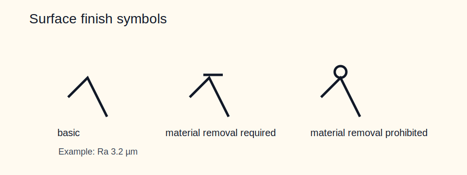

# 07 — Surface Texture



## Core rules

- State the parameter and the unit: `Ra 1.6 µm`, not just `1.6`.
- Use local symbols for critical faces and one general note for everything else.
- Specify lay when friction, sealing, or sliding behavior depends on texture direction.
- Do not use old triangle-count notation on new drawings.

## Symbol meaning

| Symbol variant | Meaning |
|---|---|
| Basic symbol | surface requirement stated, process not fixed |
| Symbol with bar | material removal required |
| Symbol with circle | material removal prohibited |

## Parameters around the symbol

| Item | Meaning |
|---|---|
| `a` | main roughness value, e.g. `Ra 3.2 µm` |
| `b` | process or note, e.g. `grind` |
| `c` | sampling length / cutoff |
| `d` | lay direction |
| `e` | stock allowance |
| `f` | secondary parameter |

## Lay direction codes

`—` parallel, `⊥` perpendicular, `X` crossed, `M` multidirectional, `C` circumferential, `R` radial, `N` non-directional.

## Typical Ra ranges by process

| Process | Typical Ra |
|---|---|
| As-cast / as-forged | 12.5 to 50 µm |
| General milling / turning | 1.6 to 6.3 µm |
| Fine turning / reaming | 0.8 to 1.6 µm |
| Grinding | 0.2 to 0.8 µm |
| Honing / lapping | 0.05 to 0.2 µm |

## N-grade reference

| N | Ra (µm) |
|---|---|
| N4 | 0.2 |
| N5 | 0.4 |
| N6 | 0.8 |
| N7 | 1.6 |
| N8 | 3.2 |
| N9 | 6.3 |
| N10 | 12.5 |
| N11 | 25 |
| N12 | 50 |

Use N-grades as a recognition aid for legacy drawings. New drawings should still state the parameter explicitly.

## Worked examples

```text
Ra 3.2 µm
Ra 0.8 µm, lay ⊥
Rz 16 / 2.5 mm
Unspecified surfaces: Ra 6.3 µm max
```

## Common mistakes

- Bare values with no `Ra` or `Rz`.
- Mixing `µm` and `µin` on the same sheet without care.
- Tight finish requirements on non-functional faces.
- Missing lay on sealing or bearing surfaces.
