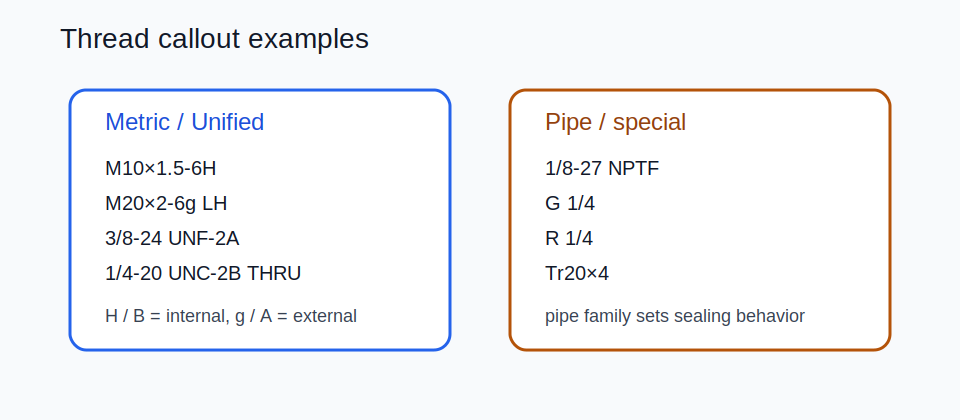

# 09 — Threads and Machining Details



## Fields to capture

- family / series
- nominal size
- pitch or TPI
- tolerance / fit class
- handedness
- threaded depth or `THRU`
- internal vs external
- sealing intent for pipe threads

## Common thread families

| Family | Example | Notes |
|---|---|---|
| Metric ISO | `M10×1.5-6H`, `M10×1.5-6g` | internal `H`, external `g/h` |
| Unified | `3/8-24 UNF-2A`, `1/4-20 UNC-2B` | `A` external, `B` internal |
| NPT / NPTF | `1/8-27 NPTF` | tapered sealing pipe thread |
| BSPP | `G 1/4` | parallel thread, usually seals with gasket or O-ring |
| BSPT | `R 1/4`, `Rp 1/4`, `Rc 1/4` | tapered / mixed Whitworth family |
| Trapezoidal / Acme | `Tr20×4`, `1"-8 Acme` | power transmission |

## Fit class cues

| System | Internal | External |
|---|---|---|
| Metric | `6H` common | `6g` common |
| Unified | `2B` common | `2A` common |

## Worked examples

```text
M10×1.5-6H
M20×2-6g LH
3/8-24 UNF-2A
1/4-20 UNC-2B THRU
1/8-27 NPTF
M6×1-6H 12 DEEP
```

## Practical notes

- If metric pitch is omitted, coarse pitch is usually assumed; call it out explicitly on critical parts.
- Pipe threads are not interchangeable just because the nominal size looks similar.
- `LH` must be stated for left-hand threads; right-hand is usually implicit.
- Through vs blind depth matters as much as the thread family.
- External and internal thread classes should not be swapped.

## Visual conventions

- External threads: major diameter shown thick, minor diameter thin.
- Internal threads: major diameter thin, minor diameter thick.
- Add chamfers, countersinks, counterbores, and thread reliefs where function requires them.
