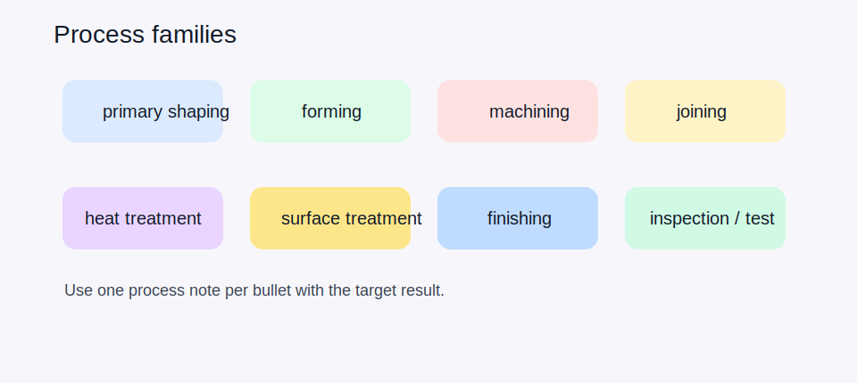

# 10 — Material, Heat Treatment, and Process Notes



## Material callouts

- Put the base material in the title block whenever possible.
- Use a recognized system: EN / ISO, ASTM, AISI, SAE, AMS, or a customer-mandated spec.
- If both name and number are shown, make sure they match.

## Heat treatment callouts

Good callouts combine the method and the target result:

```text
Q&T to 32...36 HRC
Induction harden 58...62 HRC
Case harden CHD 0.8...1.2 mm at 58...62 HRC
Nitrided NHD 0.30 mm min
```

## Process families commonly called out on drawings

| Family | Examples | Typical parameters |
|---|---|---|
| Primary shaping | cast, forged, extruded, additive | alloy, route |
| Forming | bent, rolled, deep-drawn | radius, angle, bend table |
| Machining | mill, turn, drill, grind, hone | stock allowance, order |
| Joining | weld, braze, bond, rivet | process, filler, inspection |
| Heat treatment | anneal, normalize, Q&T, nitriding | hardness, depth |
| Surface treatment | anodize, passivate, zinc plate, black oxide, paint | class, color, thickness |
| Finishing | deburr, bead blast, tumble, polish | edge rule, Ra |
| Inspection / testing | CMM, leak test, hardness test, NDT | method, acceptance |

## Practical drafting habits

- Put one process per bullet in the notes.
- State standard + class + thickness or hardness if applicable.
- For coatings, say what must be masked.
- For heat treatment, distinguish surface hardness from core hardness and from case depth.
- If process order matters, say so explicitly: `grind after heat treatment`, `anodize after final machining`.

## Example note block

```text
MATERIAL: 42CrMo4 +QT
HARDNESS: 30...34 HRC
FINISH: Zn-Ni 8 µm, clear passivation
MASK: bearing seats and threaded holes
U.O.S. SURFACE: Ra 3.2 µm
```
