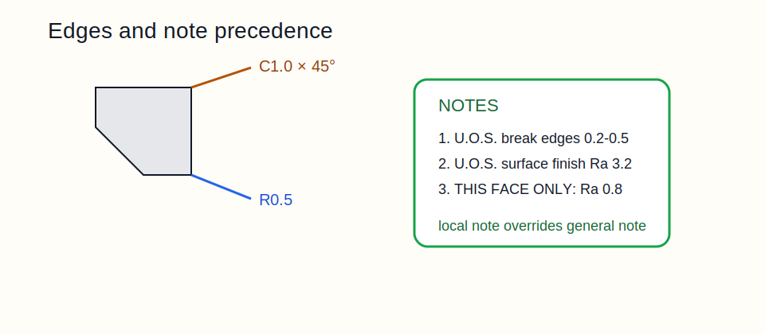

# 14 — Edges and Notes



## Edge callouts

| Callout | Meaning |
|---|---|
| `C3` | 3 mm chamfer at 45° |
| `0.5 × 45°` | explicit chamfer size and angle |
| `R0.5` | defined round / fillet |
| `Break all sharp edges 0.2-0.5` | allowable edge break range |
| `Deburr` | remove burrs, usually minimal edge break |
| `+0.2`, `-0.1`, `±0.2` | undefined edge allowance, burr / undercut style |

## Practical defaults

- Use a global edge-break rule for non-critical edges.
- Use explicit chamfers or radii on functional seating, sealing, or locating edges.
- Keep exceptions local to the feature instead of burying them in general notes.

## General notes vs local notes

| Note type | Scope | Typical content |
|---|---|---|
| Canvas / general note | whole drawing | units, defaults, finish, edge break, process |
| Sectional / local note | one feature or region | thread depth, local finish, special process |

## Precedence

`local note > general note > referenced standard`

If a feature has a leadered note, that note wins over the drawing default for that location.

## Worked examples

```text
BREAK ALL SHARP EDGES 0.2-0.5
THIS FACE ONLY: Ra 0.8 µm
Ø10 H7 REAM TO DEPTH 15
C1.0 × 45° ON COUNTERBORE MOUTH
ALL OUTER EDGES: +0.2 MAX
```

## Common mistakes

- `Deburr` with no allowable amount on a cosmetic or sealing edge.
- Local exception written in the general notes block with no feature link.
- Tiny chamfers called out everywhere, driving unnecessary machining time.
