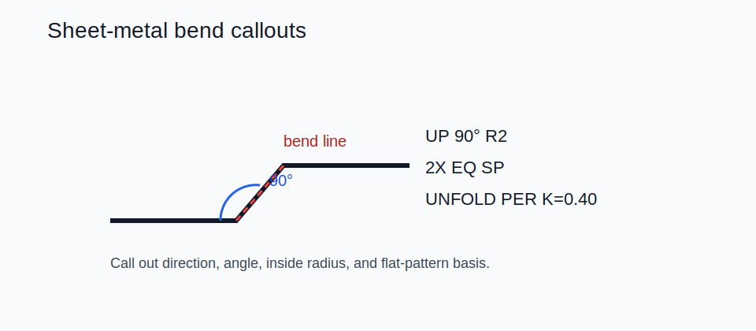

# 15 — Sheet-Metal Bends



## Common bend callouts

```text
UP 90° R2
DN 135° R1.5
2X UP 90° R2 EQ SP
UP 45° R=t
BEND ORDER: 1-2-3
UNFOLD PER K=0.40
```

## What the callout should tell you

| Element | Meaning |
|---|---|
| direction | `UP` / `DN` relative to the reference face |
| angle | usually the included angle unless stated otherwise |
| inside radius | final inside bend radius |
| count | `2X`, `4X`, etc. |
| order | bend sequence when tooling or collisions matter |
| flat-pattern basis | K-factor, bend allowance, bend deduction, or bend table |

## Bend math terms

- `BA`: bend allowance
- `BD`: bend deduction
- `SB`: setback
- `K-factor`: neutral-axis position relative to thickness

Reference formulas:

```text
BA = (π/180) × θ × (R + K × t)
SB = tan(θ/2) × (R + t)
BD = 2 × SB - BA
```

## Good forming habits

- Avoid near-zero inside radii unless coining is truly intended.
- Keep holes and slots away from the bend line when distortion matters.
- Specify bend relief or corner relief where the material would otherwise tear or bulge.
- State bend order when sequence changes fit or manufacturability.

## Common formed features

- hems
- offsets / jogs
- curls
- louvres
- embosses

## Compact example note

```text
MATL: DC01, t=1.5
ALL BENDS: INSIDE R=t
ANGLE TOL: ±1°
UNFOLD PER K=0.42
ADD RECTANGULAR RELIEF 2t × t AT BOTH BEND ENDS
```
